[한국어 README 보기](README_KR.md)

# SejongUnivMobile

This repository contains the project files for Sejong University's official
2026-1 Creative Semester project, based on a Gold Prize-winning work from
Sejong University's official 2025-2 hackathon.

The project is an unofficial integrated mobile super app for Sejong University
students. It focuses on making frequently used campus workflows easier to use,
from electronic attendance to a more intuitive mobile UI for academic and
student-life services.

- Advisor: Han Dong-il, Dean of the College of Artificial Intelligence
  Convergence, Sejong University
- Release history: previously released on Google Play Store under the name
  `세종대역`
- Status: an unofficial student project, not an official Sejong University
  service

## Logo and Trademark Notice

The use of Sejong University's official logo in the project screens was approved
for this project by the Head of Public Relations Office and the Director of
Public Relations at Sejong University.

Any separate use of Sejong University's official logo, seal, emblem, or related
brand assets requires separate permission from Sejong University.

## Features

- Electronic attendance: improved U-Check attendance and check-in flow
- Mobile student ID: student ID screen for library gate and book-loan workflows
- Timetable: semester timetables and shared free-time discovery with friends
- Library seats: real-time reading-room status, seat map, and seat reservation
- Facility reservation: campus facility availability and reservation flow
- Community: notices, news, and boards in one browsing experience
- MY Sejong: academic calendar, grades, notifications, and personal settings

## Authentication and Portal API

This project used
[Sejong-University-Portal-Auth](https://github.com/JiminLee-way/Sejong-University-Portal-Auth)
for Sejong University member authentication research and official portal API
integration validation. The companion library is a TypeScript library based on
the Sejong integrated app API and documents JWT authentication, structured JSON
responses, mobile student ID QR generation, timetable access, notices, library
seats, facility reservations, and other portal workflows.

## Screenshots

<table>
  <tr>
    <td align="center">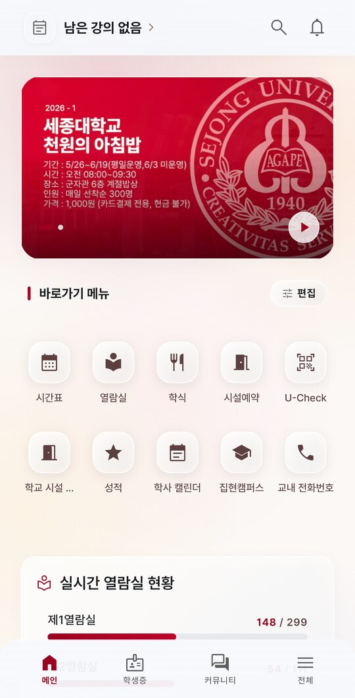<br>Home</td>
    <td align="center">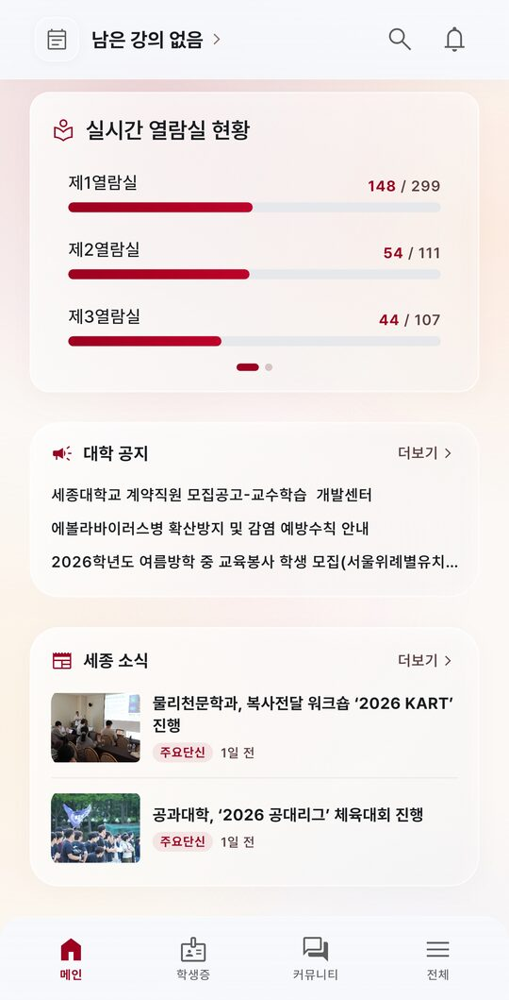<br>Library Status</td>
    <td align="center">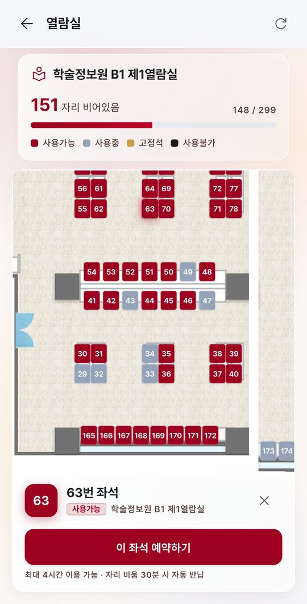<br>Seat Reservation</td>
  </tr>
  <tr>
    <td align="center">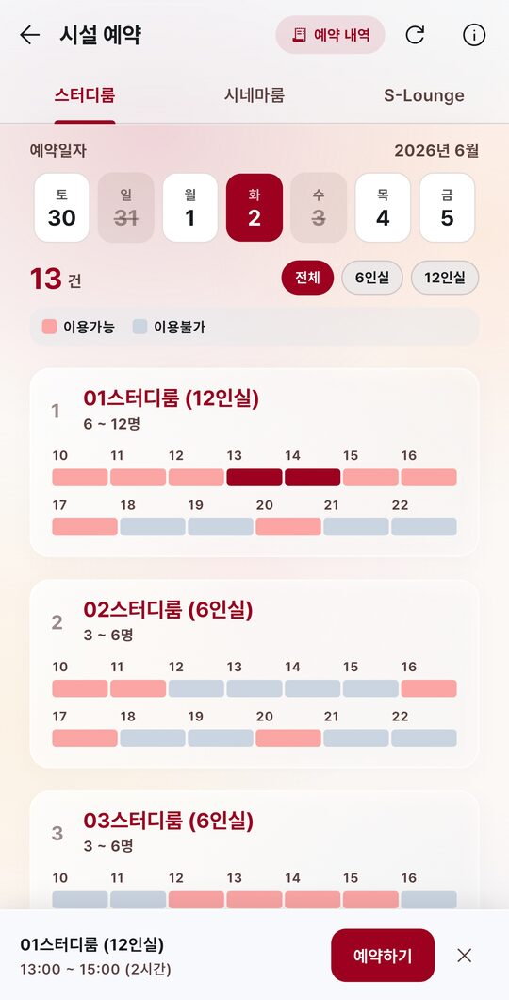<br>Facility Reservation</td>
    <td align="center">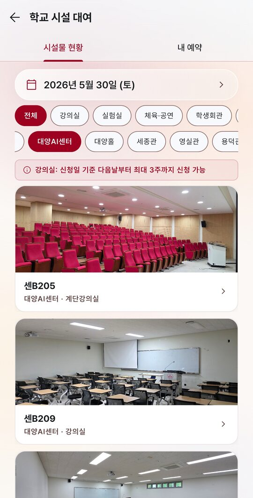<br>Facility Status</td>
    <td align="center">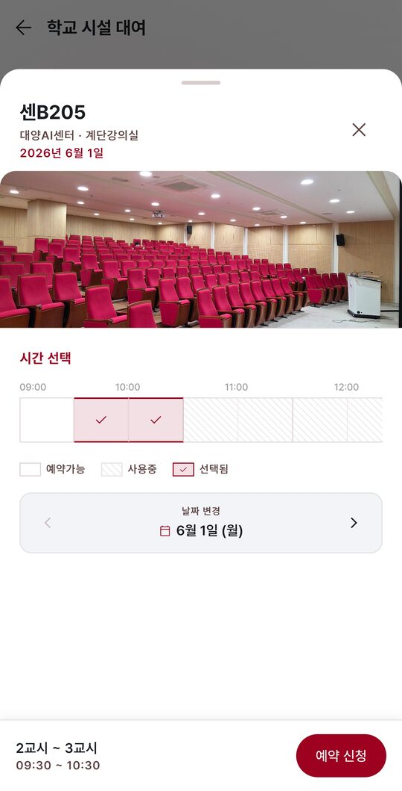<br>Facility Detail</td>
  </tr>
  <tr>
    <td align="center">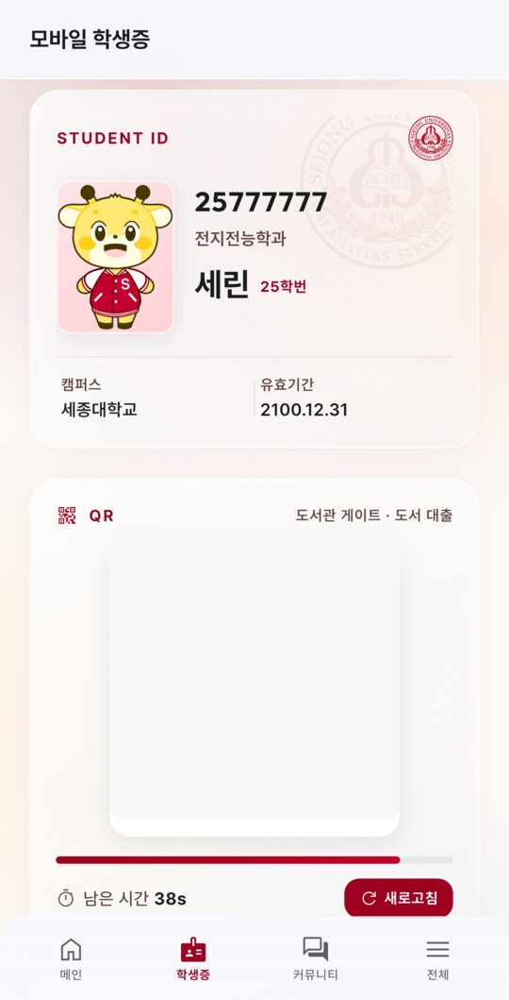<br>Mobile Student ID</td>
    <td align="center">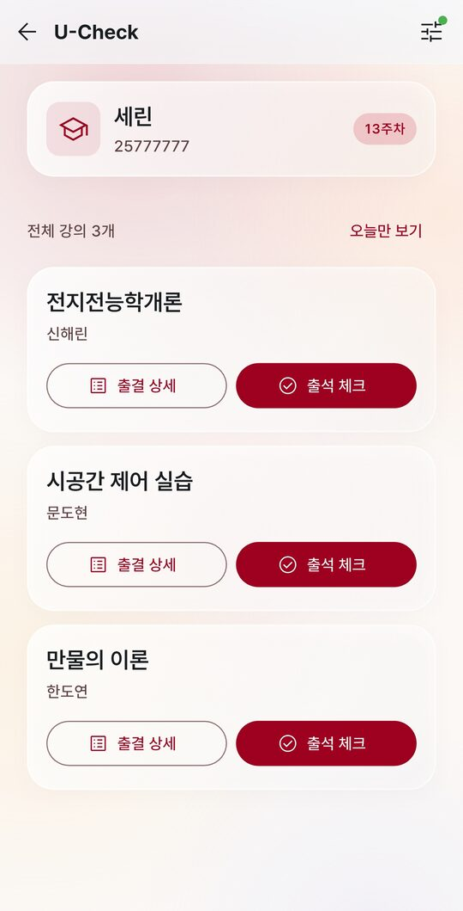<br>U-Check</td>
    <td align="center">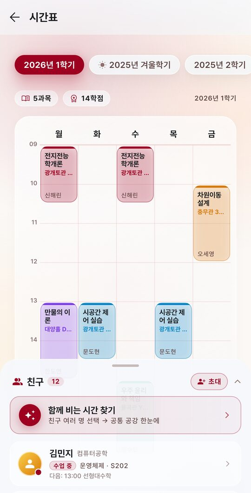<br>Timetable</td>
  </tr>
  <tr>
    <td align="center">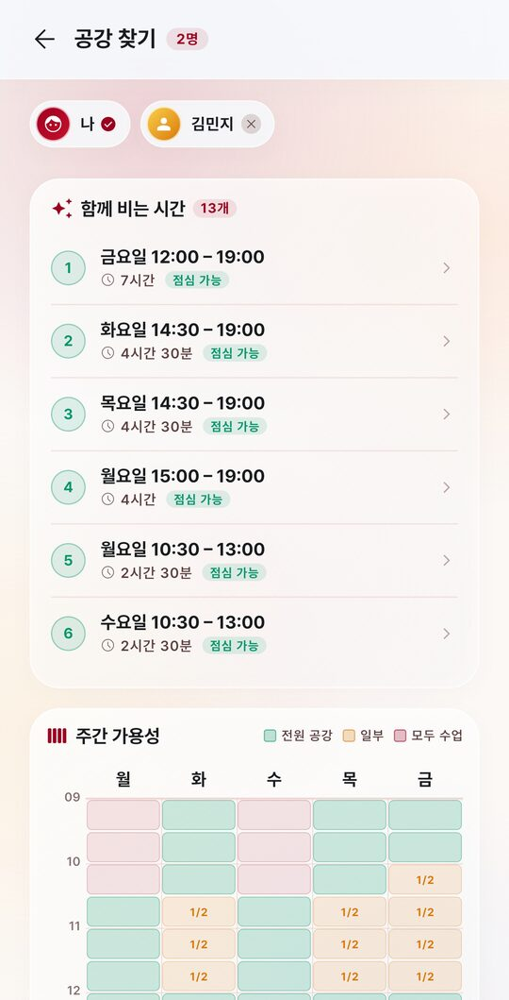<br>Free-Time Finder</td>
    <td align="center">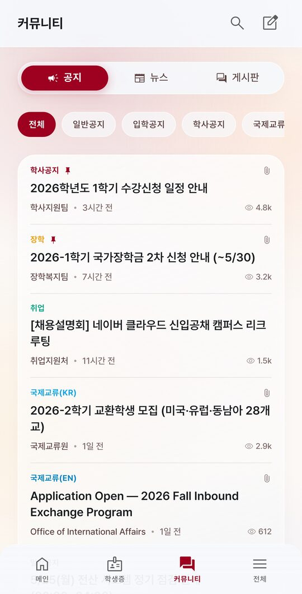<br>Community</td>
    <td align="center">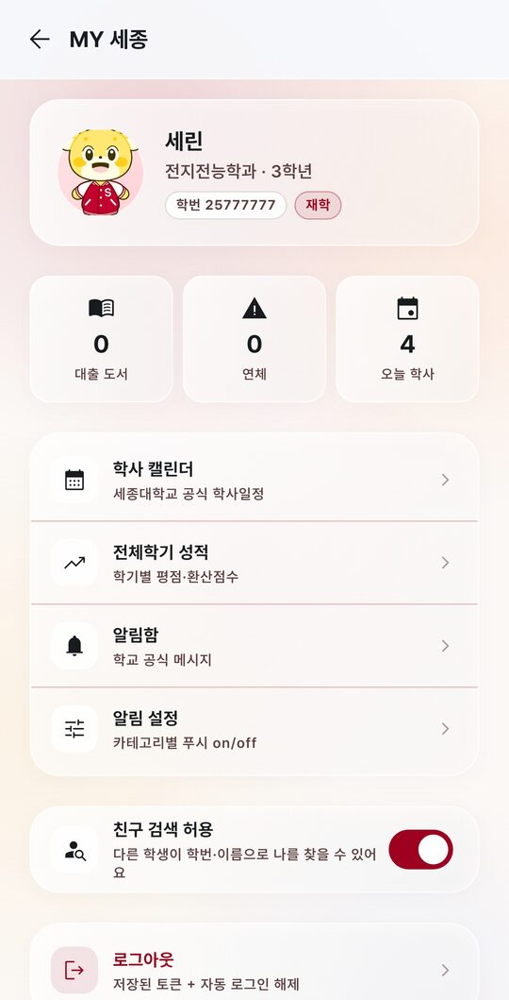<br>MY Sejong</td>
  </tr>
  <tr>
    <td align="center">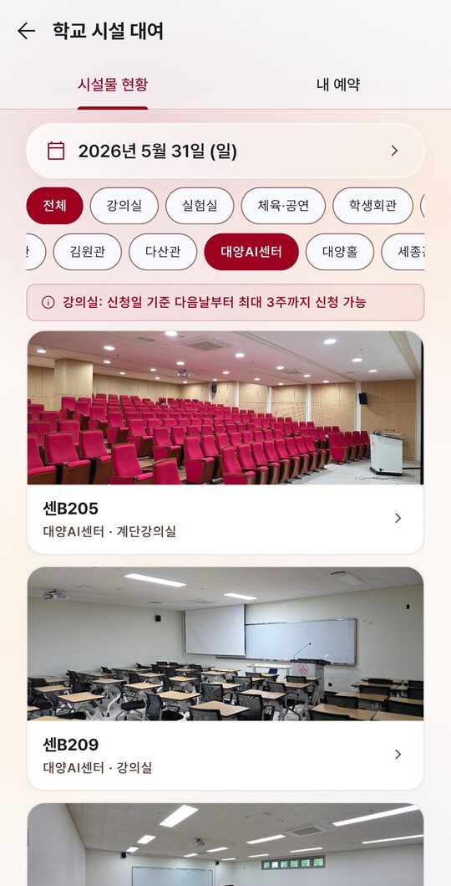<br>Campus Facility Rental</td>
    <td></td>
    <td></td>
  </tr>
</table>

The QR area in the mobile student ID screenshot is masked in the README asset to
avoid exposing QR-like data in a public repository.

## Public Repository Policy

This repository is public and intentionally excludes:

- `wiki/`, private implementation notes, and raw API captures
- `.env`, `local.properties`, `key.properties`, keystores, provisioning profiles
- service base URLs, Supabase project URL/key values, table names, RPC names,
  Edge Function names, and other deploy-time configuration
- build artifacts such as APK, AAB, and IPA files

Runtime configuration is injected with Dart defines:

```bash
cd app
flutter pub get
flutter run --dart-define-from-file=config/dart_defines.local.json
```

Copy `app/config/dart_defines.example.json` to
`app/config/dart_defines.local.json` locally, then fill it with internal service
URLs, Supabase URL/key, table names, Edge Function names, and RPC names.

Builds work the same way:

```bash
flutter build apk --debug --dart-define-from-file=config/dart_defines.local.json
```

## Internal APKs

For day-to-day internal testing, use the GitHub Actions workflow
`Android internal APK`. It builds a debug-signed APK and uploads it as an
Actions artifact. No release signing key is committed or required.

Configure repository secrets for connected internal builds:

- `SUPABASE_URL`
- `SUPABASE_ANON_KEY`
- `SEJONG_API_BASE_URL`, `SEJONG_WEB_BASE_URL`, `UCHECK_API_BASE_URL`
- `LIBSEAT_BASE_URL`, `SJPT_BASE_URL`, `HAPPYDORM_BASE_URL`
- `ANDROID_STORE_URL`
- `UCHECK_USER_AGENT`, `UCHECK_CLIENT_VERSION`, `UCHECK_DEVICE_MODEL`
- `UCHECK_AES_IV`, `UCHECK_DAILY_KEY_SALT`
- every `SUPABASE_TABLE_*`, `SUPABASE_FUNCTION_*`, and `SUPABASE_RPC_*` key
  shown in `app/config/dart_defines.example.json`
- `SENTRY_DSN` (optional)

Release signing stays outside the repository. Local release builds can copy
`app/android/key.properties.template` to `app/android/key.properties` and point
it at a private keystore. CI release signing should use a protected GitHub
Environment, Play Console, Firebase App Distribution, or another private
distribution pipeline.

The public Android network security config does not pin the cleartext attendance
host because the host itself is injected outside this repository. A private
release channel can replace that config with a host-pinned variant.

## Local Checks

```bash
cd app
flutter analyze --no-fatal-infos --no-fatal-warnings
flutter test
```
